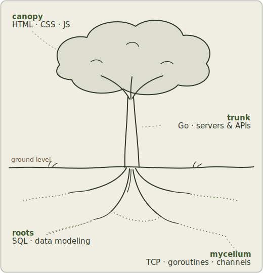

  

Fig. 1 &middot; my stack, drawn as a cross-section. Everything above ground rests on everything below.

I'm **Valentin Bosson**, a developer in training at **Zone01 Rouen**. I build web software from the roots up: Go servers and SQL below ground, accessible interfaces up in the light. Currently looking for an **alternance** in or around Rouen, full-stack or security-leaning.

The full field journal lives at **[kyuppido.github.io/portfolio](https://kyuppido.github.io/portfolio/)**, en français aussi.

### Field work

- **[forum](https://github.com/KYUPPIDO/forum)** &middot; go &middot; sqlite &middot; docker
  A discussion platform built from scratch: bcrypt auth, UUID sessions, posts, comments, votes.
- **[net-cat](https://github.com/KYUPPIDO/net-cat)** &middot; go &middot; tcp &middot; goroutines
  The classic `nc` rebuilt as a group chat: one server, many clients, pure standard library.
- **[lem-in](https://github.com/KYUPPIDO/lem-in)** &middot; go &middot; graphs &middot; pathfinding
  A digital ant farm: disjoint shortest paths and optimal colony distribution.
- **groupie-tracker** &middot; go &middot; rest apis &middot; openstreetmap
  Concert discovery with server-side merging and a geocoded venue map. Write-up on [the portfolio](https://kyuppido.github.io/portfolio/).

### The strata

- **canopy** &middot; *what people touch* : HTML &middot; CSS &middot; JavaScript
- **understory** &middot; *what does the work* : Go, plus Python and Java on the side
- **soil** &middot; *what persists* : SQL &middot; SQLite &middot; MySQL
- **mycelium** &middot; *what connects* : TCP sockets &middot; goroutines &middot; channels
- **bedrock** &middot; *always there* : Git &middot; Linux &middot; Docker &middot; VS Code

<a href="mailto:bossonvalentin5@gmail.com">bossonvalentin5@gmail.com</a> &middot; <a href="https://www.linkedin.com/in/valentin-bosson-4363133a6">LinkedIn</a> &middot; Rouen, Normandy

grown, not generated

